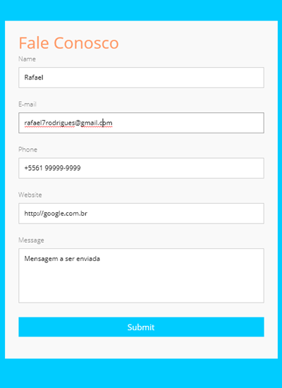
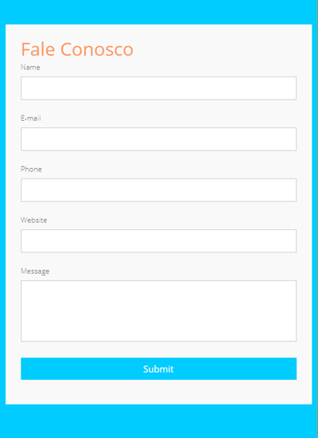

## Sobre o projeto

#### Abstraindo programação JavaScript
Criação de métodos independentes, para deixar código mais escalável e posteriormente transformar em uma biblioteca.





## Passo a Passo 
```
# Atualizar dependências
$ npm install

# Rodar em ambiente local
$ npm run dev

# Rodar em ambiente de produção
$ npm run prod
```